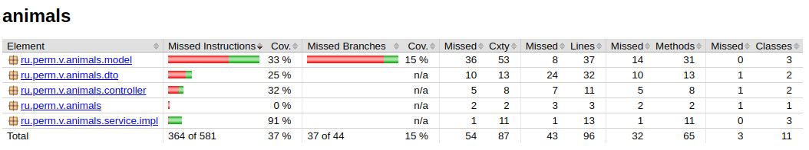

## Animals

Простой проект на java и с базой Postgres
Цель написать сервис с:
- maven (+)
- с REST API (+)
- Swagger или OpenApi (+)
- с подключением БД Postges (+)
- Flyway (+)
- Code coverage jacoco (+)
- Авторизация (https://automationqahub.com/how-to-build-rest-assured-framework-step-by-step/)
- кешем для REST
- Упаковать в Docker
- UUID
- Очереди
- REST клиент для внешнего сервиса
- Даты, Calendar
- Behave тесты (jbehave, RestAssured)
- gradle
- Kafka
- Grafana
- Prometheus
- Различные SQL запросы
- Json очередность, включение/выключение @JsonInclude(JsonInclude.Include.NON_NULL)
  @JsonPropertyOrder({ "country", "display_name", "email", "explicit_content", "external_urls", "followers", "href", "id",
  "images", "product", "type", "uri" }) https://automationqahub.com/how-to-build-rest-assured-framework-step-by-step/
- RestAssured
  - Передача переменных через Context (https://www.codingninjas.com/codestudio/library/rest-assured--how-to-pass-value-from-one-api-to-another-api-using-testng--itestcontext)
  - Json Schema Validation (https://github.com/rest-assured/rest-assured/wiki/Usage)
- Перенос на Kotlin и использование RestAssured в Kotlin (https://habr.com/ru/articles/726064/)[https://habr.com/ru/articles/726064/]
- Serenity-bdd (https://serenity-bdd.github.io/docs/tutorials/rest)[https://serenity-bdd.github.io/docs/tutorials/rest]

### База данных

Инициализация БД

Использован инструмент миграции [https://flywaydb.org](https://flywaydb.org)

Если в application.yaml установлен 
````yaml
flyway:
    enabled: false
````
то для миграции выполнить
````shell
mvn flyway:migrate -Dflyway.user=postgres -Dflyway.password=postgres -Dflyway.url=jdbc:postgresql://localhost:5432/animal
````
И не надо ОТДЕЛЬНО выполнять миграцию (mvn flyway:migrate ...), если 
````yaml
flyway:
    enabled: true
````

### Работа с psql 

Из linux! Выполнять из консоли компа с postgres
````shell
sudo -u postgres psql
psql>\c animal
animal>\dt
                 List of relations
 Schema |         Name          | Type  |  Owner   
--------+-----------------------+-------+----------
 public | animal                | table | postgres
 public | country               | table | postgres
 public | flyway_schema_history | table | postgres
 public | statistic             | table | postgres
(4 rows)
````

С удаленного компьютера
````shell
psql -U postgres -p 5432 -h 192.168.1.20
# Подключение к базе animal
psql>\c animal
// Список таблиц
animal>\dt
                 List of relations
 Schema |         Name          | Type  |  Owner   
--------+-----------------------+-------+----------
....
````

### Запуск проекта

````shell
mvn clean spring-boot:run
````

### Actuator

Доступен по адресу http :8781/actuator/

### OpenApi/Swagger

> **Внимание!**
> С версией spring 2.5.6 не работает swagger, openapi, поэтому версия spring-boot <b>2.7.5</b>

Api-docs доступен по адресу [http://127.0.0.1:8780/api/v3/api-docs](http://127.0.0.1:8780/api/v3/api-docs)

OpenApi/Swagger по адресу [http://127.0.0.1:8780/api/swagger-ui/index.html](http://127.0.0.1:8780/api/swagger-ui/index.html)

Настройка путей в application.yaml
```yaml
springdoc:
  api-docs:
    path: /api-docs
```

### Покрытие тестами

Использован jacoco. Отчет генерируется автоматически при сборке (mvn package) и результаты будут в папке
[target/site/jacoco/index.html](./target/site/jacoco/index.html)



### Тестирование REST

Проект с тестами RestAssured [https://github.com/cherepakhin/animals-rest-assured-test](https://github.com/cherepakhin/animals-rest-assured-test)