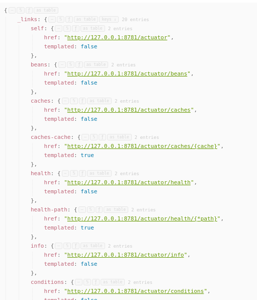
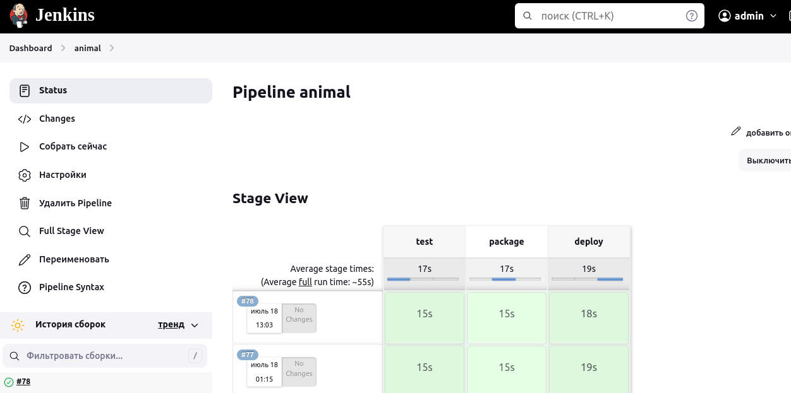

## Animals

Простой проект на java и с базой Postgres
Цель написать сервис с:
- maven (+)
- с REST API (+)
- Swagger или OpenApi (+)
- с подключением БД Postges (+)
- Flyway (+)
- Code coverage jacoco (+)
- CI/CD (+)
- [Авторизация](https://automationqahub.com/how-to-build-rest-assured-framework-step-by-step/)
- кешем для REST
- Упаковать в Docker
- UUID
- Очереди
- REST клиент для внешнего сервиса
- Даты, Calendar
- Behave тесты (jbehave, RestAssured) (+)
- gradle
- Kafka
- Grafana
- Prometheus
- Различные SQL запросы
- Json очередность, включение/выключение @JsonInclude(JsonInclude.Include.NON_NULL)
  @JsonPropertyOrder({ "country", "display_name", "email", "explicit_content", "external_urls", "followers", "href", "id",
  "images", "product", "type", "uri" }) https://automationqahub.com/how-to-build-rest-assured-framework-step-by-step/
- RestAssured
  - Передача переменных через Context (https://www.codingninjas.com/codestudio/library/rest-assured--how-to-pass-value-from-one-api-to-another-api-using-testng--itestcontext)
  - Json Schema Validation (https://github.com/rest-assured/rest-assured/wiki/Usage)
- Перенос на Kotlin и использование RestAssured в Kotlin (https://habr.com/ru/articles/726064/)[https://habr.com/ru/articles/726064/]
- Serenity-bdd (https://serenity-bdd.github.io/docs/tutorials/rest)[https://serenity-bdd.github.io/docs/tutorials/rest]
- Аудит БД [hibernate-envers](https://www.baeldung.com/database-auditing-jpa) и/или [javers](https://www.baeldung.com/javers)


### База данных

Инициализация БД

Использован инструмент миграции [https://flywaydb.org](https://flywaydb.org)

Если в application.yaml установлен
````yaml
flyway:
  enabled: false
````
то для миграции выполнить
````shell
mvn flyway:migrate -Dflyway.user=postgres -Dflyway.password=postgres -Dflyway.url=jdbc:postgresql://localhost:5432/animal
````
И не надо ОТДЕЛЬНО выполнять миграцию (mvn flyway:migrate ...), если
````yaml
flyway:
  enabled: true
````

### Работа с psql
Подключение:
````shell
sudo -u vasi psql --dbname=animal
````

где 'vasi' - имя пользователя.

Команды psql:

\connect animal или \c animal - переключение между базами данных в psql
\dt - список баз данных

````shell
psql>\c animal
animal>\dt
                 List of relations
 Schema |         Name          | Type  |  Owner   
--------+-----------------------+-------+----------
 public | animal                | table | postgres
 public | country               | table | postgres
 public | flyway_schema_history | table | postgres
 public | statistic             | table | postgres
(4 rows)
````

С удаленного компьютера
````shell
psql -U postgres -p 5432 -h 192.168.1.20
# Подключение к базе animal
psql>\c animal
# Список таблиц
animal>\dt
                 List of relations
 Schema |         Name          | Type  |  Owner   
--------+-----------------------+-------+----------
....
````

или так:

```shell
sudo -u vasi psql --dbname=animal --host=192.168.1.20
```

### Запуск проекта

````shell
mvn clean spring-boot:run
````

### Actuator

Доступен по адресу http :8781/actuator/



### OpenApi

> **Внимание!**
> С версией spring 2.5.6 не работает swagger, openapi, поэтому версия spring-boot <b>2.7.5</b>

Api-docs доступен по адресу [http://127.0.0.1:8780/api/v3/api-docs](http://127.0.0.1:8780/api/v3/api-docs)


### Swagger
OpenApi/Swagger по адресу [http://127.0.0.1:8780/api/swagger-ui/index.html](http://127.0.0.1:8780/api/swagger-ui/index.html)

Настройка путей в application.yaml
```yaml
springdoc:
  api-docs:
    path: /api-docs
```


### Покрытие тестами

Использован jacoco. Отчет генерируется автоматически при сборке (mvn package) и результаты будут в папке
[target/site/jacoco/index.html](./target/site/jacoco/index.html)


### Тестирование REST

Проект с тестами RestAssured [https://github.com/cherepakhin/animals-rest-assured-test](https://github.com/cherepakhin/animals-rest-assured-test)

### CI/CD

Установка и настройка собственного CI/CD описана в [http://v.perm.ru/main/index.php/50-organizatsiya-sobstvennogo-ci-cd](http://v.perm.ru/main/index.php/50-organizatsiya-sobstvennogo-ci-cd)

__Nexus__<br/>

Развернут личный Sonartype Nexus репозиторий [http://192.168.1.20:8081/](http://192.168.1.20:8081/)


Варианты deploy в NEXUS репозиторий:

_1) Обычный deploy:_
````shell
mvn deploy
````

Должна быть настройка:
В /.m2/settings.xml указаны имя/пароль для nexus
````xml
<?xml version="1.0" encoding="UTF-8"?>

<settings xmlns="http://maven.apache.org/SETTINGS/1.0.0" xmlns:xsi="http://www.w3.org/2001/XMLSchema-instance"
          xsi:schemaLocation="http://maven.apache.org/SETTINGS/1.0.0 http://maven.apache.org/xsd/settings-1.0.0.xsd">
  <servers>
    <server>
      <id>ru.perm.v</id>
      <username>admin</username>
      <password>pass</password>
    </server>
  </servers>
</settings>
````

В проекте в pom.xml

````xml
<distributionManagement>
  <repository>
    <id>ru.perm.v</id> <!-- !!!!! by this id take name/pass from ~/.m2/settings.xml-->
    <name>My Repository</name>
    <url>http://192.168.1.20:8081/repository/ru.perm.v/</url>
  </repository>
</distributionManagement>
````

_2) Для тестов можно так:_

````shell
 mvn deploy -Dmaven.deploy.username=user -Dmaven.deploy.password=pass
````

__Jenkins__

Развернут личный Jenkins [http://192.168.1.20:8880/](http://192.168.1.20:8880/)


### Настройка Jenkins

Выбран способ сборки Pipeline/Pipeline script. Ниже настройка Pipeline:
````shell
pipeline {
    agent any
    stages {
        stage('test') {
            steps {
                git url: 'https://github.com/cherepakhin/animals.git', branch: 'dev'
                sh "mvn test"
            }
        }
        stage('package') {
            steps {
                git url: 'https://github.com/cherepakhin/animals.git', branch: 'dev'
                sh "mvn package"
            }
        }
        stage('deploy') {
            steps {
                git url: 'https://github.com/cherepakhin/animals.git', branch: 'dev'
                sh "mvn deploy"
            }
        }
    }
}
````

Настройка pipeline:


Результаты сборки:




### Удаление внешней ветки git (master)

Основная ветка <b>main</b>, не <b>master</b>

````shell
$ git push origin -d master
````
## Animals

Простой проект на java и с базой Postgres
Цель написать сервис с:
- maven (+)
- с REST API (+)
- Swagger или OpenApi (+)
- с подключением БД Postges (+)
- Flyway (+)
- Code coverage jacoco (+)
- CI/CD (+)
- [Авторизация](https://automationqahub.com/how-to-build-rest-assured-framework-step-by-step/)
- кешем для REST
- Упаковать в Docker
- UUID
- Очереди
- REST клиент для внешнего сервиса
- Даты, Calendar
- Behave тесты (jbehave, RestAssured) (+)
- gradle
- Kafka
- Grafana
- Prometheus
- Различные SQL запросы
- Json очередность, включение/выключение @JsonInclude(JsonInclude.Include.NON_NULL)
  @JsonPropertyOrder({ "country", "display_name", "email", "explicit_content", "external_urls", "followers", "href", "id",
  "images", "product", "type", "uri" }) https://automationqahub.com/how-to-build-rest-assured-framework-step-by-step/
- RestAssured
  - Передача переменных через Context (https://www.codingninjas.com/codestudio/library/rest-assured--how-to-pass-value-from-one-api-to-another-api-using-testng--itestcontext)
  - Json Schema Validation (https://github.com/rest-assured/rest-assured/wiki/Usage)
- Перенос на Kotlin и использование RestAssured в Kotlin (https://habr.com/ru/articles/726064/)[https://habr.com/ru/articles/726064/]
- Serenity-bdd (https://serenity-bdd.github.io/docs/tutorials/rest)[https://serenity-bdd.github.io/docs/tutorials/rest]
- Аудит БД [hibernate-envers](https://www.baeldung.com/database-auditing-jpa) и/или [javers](https://www.baeldung.com/javers)


### База данных

Инициализация БД

Использован инструмент миграции [https://flywaydb.org](https://flywaydb.org)

Если в application.yaml установлен
````yaml
flyway:
    enabled: false
````
то для миграции выполнить
````shell
mvn flyway:migrate -Dflyway.user=postgres -Dflyway.password=postgres -Dflyway.url=jdbc:postgresql://localhost:5432/animal
````
И не надо ОТДЕЛЬНО выполнять миграцию (mvn flyway:migrate ...), если
````yaml
flyway:
    enabled: true
````

### Работа с psql
Подключение:
````shell
sudo -u vasi psql --dbname=animal
````

где 'vasi' - имя пользователя.

Команды psql:

\connect animal или \c animal - переключение между базами данных в psql
\dt - список баз данных

````shell
psql>\c animal
animal>\dt
                 List of relations
 Schema |         Name          | Type  |  Owner   
--------+-----------------------+-------+----------
 public | animal                | table | postgres
 public | country               | table | postgres
 public | flyway_schema_history | table | postgres
 public | statistic             | table | postgres
(4 rows)
````

С удаленного компьютера
````shell
psql -U postgres -p 5432 -h 192.168.1.20
# Подключение к базе animal
psql>\c animal
// Список таблиц
animal>\dt
                 List of relations
 Schema |         Name          | Type  |  Owner   
--------+-----------------------+-------+----------
....
````

или так:

```shell
sudo -u vasi psql --dbname=animal --host=192.168.1.20
```

### Запуск проекта

````shell
mvn clean spring-boot:run
````

### Actuator

Доступен по адресу http :8781/actuator/


### OpenApi

> **Внимание!**
> С версией spring 2.5.6 не работает swagger, openapi, поэтому версия spring-boot <b>2.7.5</b>

Api-docs доступен по адресу [http://127.0.0.1:8780/api/v3/api-docs](http://127.0.0.1:8780/api/v3/api-docs)


### Swagger
OpenApi/Swagger по адресу [http://127.0.0.1:8780/api/swagger-ui/index.html](http://127.0.0.1:8780/api/swagger-ui/index.html)

Настройка путей в application.yaml
```yaml
springdoc:
  api-docs:
    path: /api-docs
```


### Покрытие тестами

Использован jacoco. Отчет генерируется автоматически при сборке (mvn package) и результаты будут в папке
[target/site/jacoco/index.html](./target/site/jacoco/index.html)


### Тестирование REST

Проект с тестами RestAssured [https://github.com/cherepakhin/animals-rest-assured-test](https://github.com/cherepakhin/animals-rest-assured-test)

### CI/CD

Установка и настройка собственного CI/CD описана в [http://v.perm.ru/main/index.php/50-organizatsiya-sobstvennogo-ci-cd](http://v.perm.ru/main/index.php/50-organizatsiya-sobstvennogo-ci-cd)

__Nexus__<br/>

Развернут личный Sonartype Nexus репозиторий [http://192.168.1.20:8881/](http://192.168.1.20:8881/)


Варианты deploy в NEXUS репозиторий:

_1) Обычный deploy:_
````shell
mvn deploy
````

Должна быть настройка:
В /.m2/settings.xml указаны имя/пароль для nexus
````xml
<?xml version="1.0" encoding="UTF-8"?>

<settings xmlns="http://maven.apache.org/SETTINGS/1.0.0" xmlns:xsi="http://www.w3.org/2001/XMLSchema-instance"
xsi:schemaLocation="http://maven.apache.org/SETTINGS/1.0.0 http://maven.apache.org/xsd/settings-1.0.0.xsd">
  <servers>
    <server>
      <id>ru.perm.v</id>
      <username>admin</username>
      <password>pass</password>
    </server>
  </servers>
</settings>
````

В проекте в pom.xml

````xml
<distributionManagement>
  <repository>
      <id>ru.perm.v</id> <!-- !!!!! by this id take name/pass from ~/.m2/settings.xml-->
      <name>My Repository</name>
      <url>http://192.168.1.20:8081/repository/ru.perm.v/</url>
  </repository>
</distributionManagement>
````

_2) Для тестов можно так:_

````shell
 mvn deploy -Dmaven.deploy.username=user -Dmaven.deploy.password=pass
````

__Jenkins__

Развернут личный Jenkins [http://192.168.1.20:8880/](http://192.168.1.20:8880/)


### Настройка Jenkins

Выбран способ сборки Pipeline/Pipeline script. Ниже настройка Pipeline:
````shell
pipeline {
    agent any
    stages {
        stage('test') {
            steps {
                git url: 'https://github.com/cherepakhin/animals.git', branch: 'dev'
                sh "mvn test"
            }
        }
        stage('package') {
            steps {
                git url: 'https://github.com/cherepakhin/animals.git', branch: 'dev'
                sh "mvn package"
            }
        }
        stage('deploy') {
            steps {
                git url: 'https://github.com/cherepakhin/animals.git', branch: 'dev'
                sh "mvn deploy"
            }
        }
    }
}
````

Настройка pipeline:


Результаты сборки:


### Удаление внешней ветки git (master)

Основная ветка <b>main</b>, не <b>master</b>

````shell
$ git push origin -d master
````
