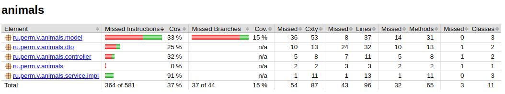

## Animals

Простой проект на java и с базой Postgres
Цель написать сервис с:
- maven (+)
- с REST API (+)
- Swagger или OpenApi (+)
- с подключением БД Postges (+)
- Flyway (+)
- Code coverage jacoco (+)
- Behave тесты (jbehave, RestAssured)
- кешем для REST
- Упаковать в Docker
- UUID
- Очереди
- REST клиент для внешнего сервиса
- Даты, Calendar
- gradle
- Kafka

### База данных

Инициализация БД

Использован инструмент миграции [https://flywaydb.org](https://flywaydb.org)

Если в application.yaml установлен 
````yaml
flyway:
    enabled: false
````
то для миграции выполнить
````shell
mvn flyway:migrate -Dflyway.user=postgres -Dflyway.password=postgres -Dflyway.url=jdbc:postgresql://localhost:5432/animal
````
И не надо ОТДЕЛЬНО выполнять миграцию (mvn flyway:migrate ...), если 
````yaml
flyway:
    enabled: true
````

### Работа с psql 

Из linux! Выполнять из консоли компа с postgres
````shell
sudo -u postgres psql
psql>\c animal
animal>\dt
                 List of relations
 Schema |         Name          | Type  |  Owner   
--------+-----------------------+-------+----------
 public | animal                | table | postgres
 public | country               | table | postgres
 public | flyway_schema_history | table | postgres
 public | statistic             | table | postgres
(4 rows)
````

С удаленного компьютера
````shell
psql -U postgres -p 5432 -h 192.168.1.20
# Подключение к базе animal
psql>\c animal
// Список таблиц
animal>\dt
                 List of relations
 Schema |         Name          | Type  |  Owner   
--------+-----------------------+-------+----------
....
````

### Проведение тестов
Из каталога проекта, там где находится pom.xml, выполнить:
```shell
cd proj
mvn test 
```

### Запуск
Из каталога проекта, там где находится pom.xml, выполнить: 
```shell
cd proj
mvn spring-boot:run
```

### Actuator

Доступен по адресу http :8781/actuator/

### OpenApi/Swagger

> **Внимание!**
> С версией spring 2.5.6 не работает swagger, openapi, поэтому версия spring-boot <b>2.7.5</b>

Api-docs доступен по адресу [http://127.0.0.1:8780/api/v3/api-docs](http://127.0.0.1:8780/api/v3/api-docs)

OpenApi/Swagger по адресу [http://127.0.0.1:8780/api/swagger-ui/index.html](http://127.0.0.1:8780/api/swagger-ui/index.html)

Настройка путей в application.yaml
```yaml
springdoc:
  api-docs:
    path: /api-docs
```

### Покрытие тестами

Использован jacoco. Отчет генерируется автоматически при сборке (mvn package) и результаты будут в папке
[target/site/jacoco/index.html](./target/site/jacoco/index.html)



### Ручное тестирование REST

Выполняется из коммандной строки, с использованием утилиты [httpie](https://httpie.io/)

````shell
$ http :8780/api/animal/
HTTP/1.1 200 
Connection: keep-alive
Content-Type: application/json
Date: Thu, 23 Mar 2023 14:50:07 GMT
Keep-Alive: timeout=60
Transfer-Encoding: chunked

[
    {
        "id": 0,
        "name": "Заяц"
    },
    {
        "id": 1,
        "name": "Волк"
    },
    {
        "id": 2,
        "name": "Корова"
    }
]
````

### Behave тестирование

Использован RestAssured [https://github.com/rest-assured/rest-assured](https://github.com/rest-assured/rest-assured/wiki/GettingStarted)

Проект с тестами [https://github.com/cherepakhin/animals-rest-assured-test](https://github.com/cherepakhin/animals-rest-assured-test)
